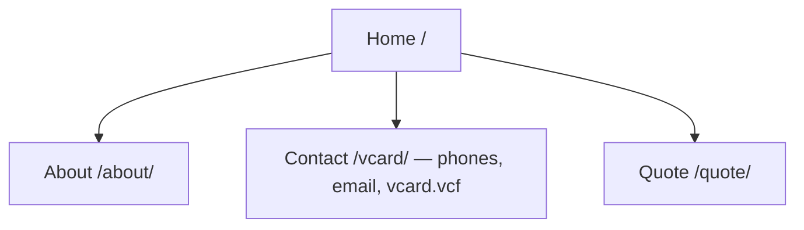
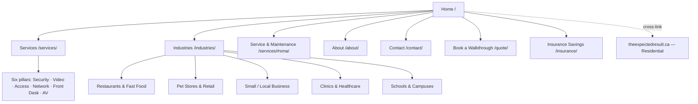

# ER Tech Services — Commercial Website Build Brief

**For:** Claude Code (drop in the repo root as `BRIEF.md` and work from it)
**Prepared:** June 2026 · **Owner:** Vince — Expected Result Technical Services Corporation, Langley, BC
**Scope this phase:** build the **commercial site only** (ertechservices.ca). The residential site stays on its current WordPress for now; we just cross-link to it. Build the design system so a residential rebuild later is a drop-in.

---

## 0. TL;DR

Build the **commercial / institutional website** at **ertechservices.ca** that matches the printed pamphlets (colours, fonts, six pillars, SMA tiers, licensing) and clearly reads as **Expected Result Technical Services Corporation**.

Company family (end-state vision):

| Domain | Audience | Brand | Status this phase |
|---|---|---|---|
| **ertechservices.ca** | Commercial / institutional | **ER Tech Services** (ER = Expected Result) | **Build now** (this brief) |
| **theexpectedresult.ca** | Residential | **The Expected Result — "Your Expectations, Met."** | **Leave on WordPress as-is**; cross-link only. Rebuild later. |

The commercial site:
- Names the **legal entity — Expected Result Technical Services Corporation — at the forefront**.
- Cross-links to the residential WordPress site ("Looking for home/residential? → theexpectedresult.ca").
- Is a **static Astro site** built from the **pamphlet design tokens**, so the printed card-stock pieces and the web pages never drift.

---

## 1. Decisions — status

1. **Domain / brand architecture — RESOLVED.** Two brands under one legal entity. ertechservices.ca = commercial (this build); theexpectedresult.ca = residential (separate). No cross-domain redirect; cross-linked. Legal entity at forefront.
2. **Brand lockup — RESOLVED (confirm).** Commercial site leads with the **ER Tech Services** wordmark; legal entity "Expected Result Technical Services Corporation" sits in the masthead line and footer. *(Your "2" came through with no detail — confirm or specify the exact lockup.)*
3. **Sequencing / WordPress — RESOLVED.** Build **commercial now**. **Leave theexpectedresult.ca on WordPress untouched** this phase. Residential rebuild = later phase.
4. **Phone labelling — confirm.** Live residential Contact lists `778-808-8769` as **Sheryl's**; pamphlets label it **"Office."** Use one convention on the commercial site (pamphlets use "Office"). `778-246-2492` mobile is consistent.
5. **License string — confirm.** Pamphlets print *"Security Consultant Lic. #B7128 · TSBC LIC-00214786."* Verify exact designation/numbers off the letterhead before publishing.

> **Important deploy note:** ertechservices.ca **currently auto-forwards** to theexpectedresult.ca. That forward must be **removed** and the domain pointed at its own hosting docroot before the new site can go live (see §10).

---

## 2. Brand architecture (how the family reads)

```
            Expected Result Technical Services Corporation   ← legal entity, named at forefront
           ┌───────────────────────────────┴───────────────────────────────┐
   ER Tech Services (ertechservices.ca)                The Expected Result (theexpectedresult.ca)
   Commercial · Institutional  ◀── BUILD NOW            Residential · stays on WordPress (cross-link only)
   Six pillars · SMA · Industry pages                   "Your Expectations, Met."
           └───────── shared design tokens (reused when residential is rebuilt) ─────────┘
```

- **Masthead:** ER Tech Services wordmark + small line "Expected Result Technical Services Corporation."
- **Footer:** legal entity, Langley BC, contact, licensing, and a cross-link to theexpectedresult.ca.
- "ER" is literally **Expected Result** — lean on that in copy so the brands obviously belong together.

---

## 3. Tech stack & why

| Layer | Choice | Why |
|---|---|---|
| Framework | **Astro** (static output) | Component-based, ships ~zero JS, outputs plain HTML you can upload anywhere. |
| Styling | **Plain CSS custom properties** (tokens) | Reuse the pamphlet variables verbatim; no Tailwind dependency. |
| Forms | **Static endpoint** (Formspree / Web3Forms / host PHP mailer) | No backend to maintain. |
| Fonts | **Barlow + Barlow Semi Condensed**, self-hosted | Exact pamphlet match. |
| Deploy | **`astro build` → upload `dist/` via cPanel/FTP** | See §10. |

**Zero-build fallback:** plain multi-page HTML sharing one `styles.css`. Less maintainable; Astro is the recommendation.

---

## 4. Project structure (single Astro site, design system isolated for reuse)

```
ertech-commercial/
├─ BRIEF.md
├─ astro.config.mjs · package.json
├─ public/
│  ├─ fonts/                     ← self-hosted Barlow woff2
│  ├─ img/                       ← hero/section photos, partner logos
│  └─ downloads/                 ← the six service one-pagers + the insurance-savings flyer; a `/marketing/` subfolder holds the editable Word overview and the tri-fold brochure (card-stock pieces)
├─ src/
│  ├─ design/                    ← KEEP PORTABLE for the future residential rebuild
│  │  ├─ tokens.css              ← §5 tokens (single source of truth)
│  │  └─ components/
│  │     ├─ ServiceCard.astro · SmaTiers.astro · IntroBanner.astro
│  │     ├─ Masthead.astro · SiteFooter.astro · CtaBar.astro · QuoteForm.astro
│  ├─ data/
│  │  ├─ site.ts                 ← brand, contact, licensing, nav, residential cross-link URL
│  │  └─ services.ts             ← six pillars + bullets (fed to cards everywhere)
│  ├─ layouts/Base.astro
│  └─ pages/
│     ├─ index.astro             ← Home
│     ├─ services/index.astro    ← six pillars + #sma section
│     ├─ industries/
│     │  ├─ index.astro · restaurants.astro · retail-pet.astro · small-business.astro · clinics.astro
│     ├─ about.astro · contact.astro · quote.astro
└─ dist/                         ← build output you upload to ertechservices.ca
```

Everything brand/content lives in `src/data/site.ts` + `services.ts`; everything visual lives in `src/design/`. When residential is rebuilt later, `src/design/` lifts straight out into a shared package.

---

## 5. Site map

### Current — theexpectedresult.ca (WordPress; unchanged this phase)


### Build now — ertechservices.ca (commercial)

**Nav:** Home · Services · Industries · About · Contact · **Book a Walkthrough**
**Footer:** legal entity · Langley BC · contact · licensing · cross-link to theexpectedresult.ca.

---

## 6. Brand system / design tokens

`src/design/tokens.css` — lifted from the pamphlets.

**Type:** headings `Barlow Semi Condensed` (600/700); body `Barlow` (400/500/600).

```css
:root{
  --ink:#1a2230; --line:#d8dde6; --paper:#ffffff;
  --sec:#214a5f; --vid:#b07514; --acc:#1f8a6d; --net:#3b3f8f; --rec:#1f8aa0; --av:#6a2a6e;
  --brand:#39c6c0;
}
```
**Gradients:** header L `#0f2c33→#1f6d6a`, header R `#33414f→#536271`; intro banner `#c2731a→#7a3f7e→#2f3f86`; footer `#14202b→#1d2c3a`; card caps — sec `#15323f→#2f5f70`, vid `#9a5f10→#caa233`, acc `#157a55→#37a98a`, net `#2c2f73→#5258b0`, rec `#176a7e→#2ca7bd`, av `#4b1d54→#8a3a90`; section rule `#1f8a6d→#3b3f8f→#6a2a6e`.
**SMA tiers:** Standard `#8aa6bb` · Priority `#2f8fc0` · Premium (gold) `#caa233`.
**Wordmark:** `ER` + `Tech`(in `--brand`) + `Services`; legal-entity line under it. Swap in a real logo if one exists.
**Voice:** confident, plain-spoken, tradesperson-credible; "under one roof," honest tradeoffs over hype. Canadian English.

---

## 7. Reusable components

- **`ServiceCard`** — props `accent`(sec/vid/acc/net/rec/av), `icon`, `title`, `items[]`; gradient cap + bulleted body, exactly like the pamphlets.
- **`SmaTiers`** — Standard / Priority / Premium strip, Premium gold-highlighted. Standard = next business day · Priority = same-day · Premium = 4-hr · 24/7. Note: "SMA clients always jump the queue ahead of non-contract calls."
- **`IntroBanner`** — amber→purple→indigo gradient page intro.
- **`Masthead` / `SiteFooter`** — read brand, contact, licensing, residential cross-link from `site.ts`.
- **`QuoteForm`** — Name, Email, Phone, Type (Restaurant/Retail/Pet/Office/Clinic/Other), Message → form endpoint.
- **`CtaBar`** — repeating "Schedule a walkthrough" CTA.

`services.ts` holds the six pillars + bullets so Services, Industries, and Home share one source — no copy drift.

---

## 8. Page specs (commercial)

- **Home** — hero "One trusted partner — front door to back office," six pillars at a glance, SMA teaser, industries row, service-area + partner logos, CTA, residential cross-link.
- **Services** — six pillars expanded; `#sma` section with the tier strip.
- **Industries** — index + five pages (Restaurants, Retail/Pet, Small Business, Clinics/Healthcare, Schools & Campuses). Each mirrors its pamphlet: tailored intro, six tailored cards, support panel, SMA tiers, vertical CTA, and a **"View / print this one-pager (HTML)"** button.
- **About** — company, value props, service area (Pemberton through the Fraser Valley to Hope, across Metro Vancouver, Vancouver Island, the Gulf Islands & the Sunshine Coast), ecosystems/partners, licensing, legal entity.
- **Contact** — phones, obfuscated email, a **vCard download + QR code** that both point to `/contact.vcf` (the vCard ships at the site root in `public/contact.vcf`), service-area note. QR assets are in `public/downloads/marketing/`: a URL QR to `/contact.vcf` and a self-contained vCard QR with the contact encoded directly (works offline). **No street address** (Vince's residence) — "Langley, BC" only.
- **Book a Walkthrough** — QuoteForm + confirmation state.
- **Insurance Savings `/insurance/`** — marketing page built from the insurance flyer copy: monitored-system discounts (5–20%), ULC-certified monitoring, water-leak/freeze detection + the Alarm.com inline smart shutoff valve, insurer recognition (Aviva · Intact · Allstate · Desjardins), and the "ask us about the monitoring certificate" note. Drive it from a **homepage callout** (`SITE.promos`) and a link from the Security & Alarm pillar. Offer the printable flyer download. **Two flyer versions are provided** — `insurance-savings.html` (specific 5–20% / $75–$300 figures + named insurers) and `insurance-savings-soft.html` (evergreen, no figures/names). Pick one for web + print; the figures version needs periodic fact-checking.

*Residential pages = later phase; out of scope this build.*

---

## 9. Print parity (card stock)

- Store the six HTML one-pagers in `public/downloads/`; link from the matching pages. They open in-browser and print to 11x17 from there (no PDF step).
- Same tokens → web and print can't diverge.
- Print setup locked: **11×17 tabloid, portrait, ~0.35″ margins**, background graphics on.
- Add a **QR code** on each printed card → its industry page (e.g. restaurant card → `/industries/restaurants/`).

---

## 10. Build & deploy (for Code)

1. `npm create astro@latest ertech-commercial -- --template minimal --typescript`
2. Add `src/design/tokens.css` (§6) + self-host Barlow; build the components in §7; verify one `ServiceCard` matches the pamphlet pixel-for-pixel.
3. Fill `site.ts` + `services.ts`; build Home → Services → Industries → About → Contact → Quote. Drop the six HTML one-pagers + QR codes in `public/downloads/`.
4. Wire the quote form to the endpoint; test a submission.
5. `npm run build` → `dist/`.
6. **Deploy to ertechservices.ca:**
   - **Remove the existing domain forward** on ertechservices.ca (it currently auto-forwards to theexpectedresult.ca) and point the domain at its own hosting docroot. *Do not touch theexpectedresult.ca / its WordPress.*
   - Upload the contents of `dist/` to that docroot (cPanel File Manager or FTP/SFTP).
   - Enable SSL (Let's Encrypt) and enforce `https://`.
   - Confirm the footer **cross-link to theexpectedresult.ca** works and that site is unaffected.
7. Smoke-test mobile + desktop: nav, form, one-pager links, cross-link, SSL.

---

## 11. Done / acceptance checklist

- [ ] Components (six cards, SMA strip, masthead, footer) match the pamphlets via shared tokens
- [ ] Legal entity named at forefront; footer cross-links to theexpectedresult.ca
- [ ] Brand/contact/licensing come from one config file (`site.ts`)
- [ ] Five industry pages mirror their pamphlets and offer the HTML one-pager links
- [ ] Insurance Savings page live, with homepage callout (SITE.promos) + flyer download
- [ ] Quote form delivers to inbox; no street address published
- [ ] Responsive; Lighthouse ≥ 95 perf/SEO/accessibility
- [ ] Per-page title/meta/OG; `sitemap.xml` + `robots.txt`
- [ ] ertechservices.ca forward removed, domain on its own docroot, SSL enforced
- [ ] theexpectedresult.ca / WordPress untouched and still working

---

## 12. Assets to gather (Vince)

- [ ] ER Tech Services logo (SVG/PNG) if a real mark exists; else CSS wordmark
- [ ] 3–6 own job-site photos (installs, racks, storefronts, boardrooms)
- [ ] Partner logos (Control4, Crestron, Lutron, Alarm.com, Hikvision, DSC, Araknis, UniFi) + usage rights
- [ ] Final licensing string/numbers off the letterhead
- [ ] The six service one-pagers + insurance-savings flyer (already built)
- [ ] Form endpoint key (Formspree/Web3Forms) or host SMTP details

---

## 13. Reference — captured content (so Code isn't guessing)

**Commercial pillars (pamphlets):** Security & Alarm · Video Surveillance · Access Control · Network Infrastructure · Front Desk/Reception · AV, Audio & Conference · Additional Support · SMA tiers
**Commercial contact (pamphlets):** Langley, BC · Mobile 778-246-2492 · Office 778-808-8769 · results@ertechservices.ca
**Service area:** Pemberton → Fraser Valley → Hope · Metro Vancouver · Vancouver Island · Gulf Islands · Sunshine Coast
**Ecosystems:** Control4 · Crestron · Lutron · Alarm.com · Hikvision · DSC PowerSeries Neo/PowerG · Araknis · UniFi · HALO Smart Sensor
**Legal entity:** Expected Result Technical Services Corporation
**Residential cross-link target:** https://theexpectedresult.ca (live WordPress, unchanged)
**LinkedIn:** linkedin.com/in/vinceyost
